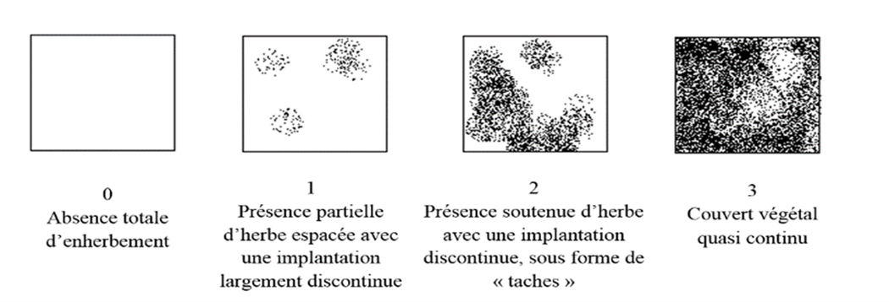
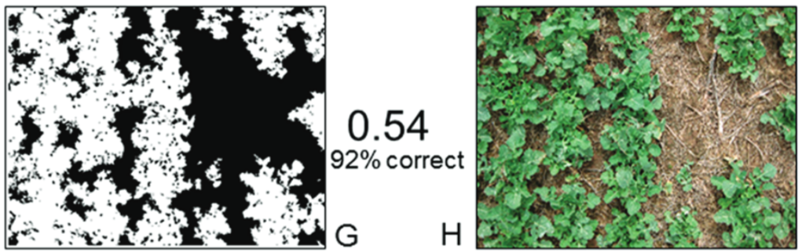

# Objectif

L'objectif de la mesure est d'évaluer le taux de couverture du sol par la végétation (adventices ou couvert semé). Ce taux de couverture est un indicateur qui peut être utile dans différentes situations :

-   Pour évaluer l'efficacité d’une technique de désherbage
-   Pour évaluer un niveau de concurrence potentiel du couvert végétal sur la vigne
-   Pour évaluer le développement d'un couvert semé

# Principe de la mesure

La mesure consiste à estimer le pourcentage de sol recouvert par un couvert végétal, en opposition avec le sol nu. Cette estimation est réalisée soit par estimation visuelle soit en utilisant des outils d'analyse d'image (application mobile ou post-traitement de photographies). Selon les objectifs, il pourra être utile de différencier :

-   le couvert végétal fonctionnel (vert) et le couvert desséché (mulch),
-   les zones selon leurs modalités d'entretien du sol (sous le rang / inter-rang).

{width="620"}

Cette mesure générale peut être complétée par des mesures différenciées par adventice, ce qui nécessite l'identification des espèces présentes. Pour ce type de mesure, il est préférable d'utiliser d'autres méthodes de mesures (quadrat), non présentées ici.



# Sur le terrain

## Échantillonnage

### Nombre d'observations

Un minimum de 3 observations est à réaliser, à adapter suivant la taille et la variabilité sur le terrain.

### Choix des zones à observer

Chaque zone d'observation doit être suffisamment grande pour éviter les variations trop locales, mais pas trop grande pour que l'estimation reste fiable. En cas d'estimation visuelle, une longueur maximale d'environ 5m est recommandée. Au-delà, il est préférable de faire plusieurs mesures ou d'utiliser des outils d'estimation.

::: callout-note
Si vous souhaiter évaluer un taux de couverture global pour la parcelle, différencier les zones selon leurs modalités d'entretien du sol (sous le rang / inter-rang) et mesurer la largeur de chaque zone.
:::

## Mesure

### Réalisation

#### Par estimation visuelle

Le pourcentage de couverture du sol est estimé visuellement par l'opérateur qui donne une valeur entre 0 et 100. Dans la pratique, il est important de prendre des repères visuels pour bien limiter la zone à évaluer, qui ne doit pas être trop grande. L’effet observateur est potentiellement important, et il doit être pris en compte, en particulier en cas d’observateurs multiples :

-   Entraîner les observateurs
-   Caler les observateurs entre eux (tous les observateurs évaluent une série commune de placettes)
-   Adapter la collecte des données au plan d’expérience (par exemple chaque observateur observe un bloc complet)
-   Utiliser un abaque d'estimation visuelle (voir Annexe)

Bien que moins précis qu'une estimation visuelle, il peut être par contre plus rapide de réaliser une notation en classes (@fig-classes).

{#fig-classes}

::: callout-tip
L'estimation visuelle étant par nature variable et subjective, l'utilisation d'un outil basé sur l'analyse d'image est recommandé. Attention toutefois, ceux qui existent actuellement ne permettent pas de différencier le sol nu du mulch.
:::

#### Par analyse d'image

##### Au champ, avec une application mobile

Il existe plusieurs applications permettant d’automatiser l’évaluation du taux de couverture (Canopeo, Canopy Cover). Canopeo est une application reconnue par la communauté scientifique [@patrignani2015].

Avec l’application Canopeo, pour prendre en considération l’influence de l’ensoleillement et des ombres portées, réaliser une mesure sur la gauche puis sur la droite du rang sur lequel est disposée la placette.

En utilisant le mode video de l’application on obtient une moyenne de 2 mesures par mètre de long de chaque côté. Pour une placette de 10m de long, cela permet d’obtenir 40 valeurs par placette, résumées en 2 moyennes.

::: callout-warning
En cas de présence de mulch, et selon les objectifs, il peut être utile de différencier la part entre couvert végétal fonctionnel et couvert végétal non-fonctionnel. L’application Canopeo **ne permet pa**s de faire cette différence.
:::

##### En post-traitement des photos prises au champ

Il est aussi possible d’analyser les images en post-traitement, par exemple sur [Canopeo](https://canopeoapp.com/). Il est nécessaire de créer un compte. Attention, il importe de bien nommer et organiser ses photos pour pouvoir faire le lien avec les zones et parcelles observées.

Pour obtenir un indicateur de développement du couvert, une mesure de la hauteur moyenne du couvert est estimée visuellement ou à l’aide d’une règle. Une mesure par placette suffit, elle vise juste à caractériser le « volume » de végétation présent.

::: callout-note
Pour une estimation plus précise de la biomasse d’un couvert, en particulier pour les engrais verts, l’utilisation de la méthode [MERCI](https://methode-merci.fr/) est recommandée.
:::

### Outils

La mesure peut être réalisée avec l’application Canopeo [@patrignani2015].

{width="506"}

### Période de mesure

Suivant les objectifs, tout au long de la saison, en privilégiant les stades clés : débourrement, floraison, véraison, récolte et repos végétatif.

Pour évaluer l’efficacité d’une technique de désherbage, mesures à effectuer à T0 (avant), T+2j, T+7j, T+ 14j et T+30 jours.

### Aspects pratiques

Mesure assez rapide réalisable à une personne.

# Traitement des résultats

## Définition des variables

### Taux de couverture

Le taux de couverture du sol est exprimé en pourcentage. Bien préciser s’il s’agit de couvert fonctionnel uniquement ou si le mulch est aussi pris en compte.

La hauteur moyenne du couvert est exprimée en cm.

### Soil cover days

En cas de suivi temporel, des moyennes peuvent être calculées pour comparer les modalités.

La couverture du sol durant une certaine période peut être exprimée en «soil cover days» (SCD) [@büchi2016]. Le nombre de SCD est calculé en additionnant les taux quotidiens de couverture du sol (entre 0% et 100%) durant la période considérée. Une valeur de 1 SCD peut donc signifier qu’une parcelle est couverte à 100% pendant 1 jour, ou à 50% pendant 2 jours.

## Interprétation des résultats

Le taux de couverture du sol est à interpréter selon les objectifs du suivis. Il peut donner une indication sur la performance d'une technique de désherbage, mais aussi, selon la période considérée, sur le potentiel de concurrence du couvert pour la vigne. C'est aussi un indicateur environnemental pertinent, une couverture du sol inférieure à 30% est considérée comme critique en termes de perte en nutriments et d’érosion [@FAO_website].

# Compléments d'information

## Ressources complémentaires

Site web [Canopeo](https://canopeoapp.com/)

Page [web](https://www.agroscope.admin.ch/agroscope/fr/home/themes/environnement-ressources/monitoring-analyse/indicateurs-agro-environnementaux/couverture-du-sol.html) de l'Agroscope Changins (Suisse) sur la couverture du sol et indicateurs agro-environnementaux

::: {.content-visible when-format="docx"}
## Source et mise à jour

Cette fiche est disponible sur ce [site web](https://vignevin.github.io/methodo/).

N'oubliez pas de vérifier les mises à jour disponibles !
:::



## Annexe : Abaque d'estimation du taux de couverture du sol

![Abaque d’estimation du recouvrement du sol par les cultures, les adventices, le mulch et/ou les cailloux [@bayley2001]](images/sol_cov_chart_coverage_bayley.png)



## Références
