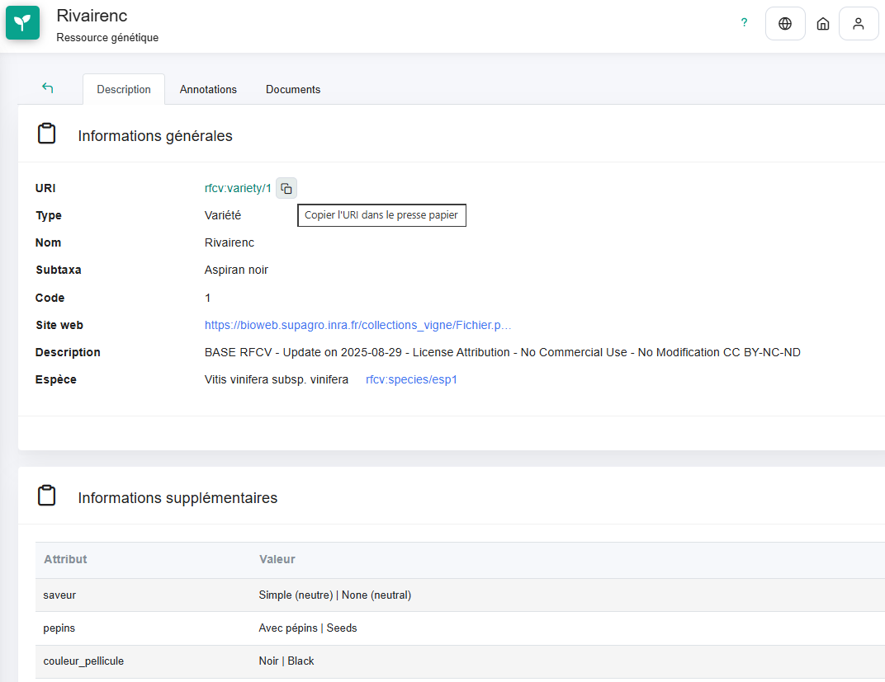

Pour pouvoir identifier le matériel végétal (espèces, cépages ou variétés, clones) sans ambiguïté, le centre de ressource Viti-Oeno propose un référentiel du matériel végétal en vigne.

::: callout-tip
## Accès au référentiel

Consulter le référentiel sur le centre de ressource sur [ce lien](https://vitioeno.mistea.inrae.fr/resource/app/germplasm?page=1&page_size=100).
:::

# Description du référentiel

Dans ce référentiel, chaque élément est identifié par une URI, par exemple `rfcv:variety/1`, et c'est cette URI qui doit être utilisée dans les jeux de données pour identifier le matériel végétal.

{width="606"}

Le référentiel est mis à jour **annuellement**.

## Les espèces de vigne

La liste des espèces de vigne est extraite de la [base de données](https://bioweb.supagro.inra.fr/collections_vigne/Home.php)du Réseau Français des Conservatoires de Vigne [@rfcv].

## Les variétés de vigne

La liste des variétés (ou cépages) est aussi extraite de la base du RFCV [@rfcv]. Les variétés inscrites au Catalogue français sont spécifiquement identifiées dans le groupe [Variétés inscrites au catalogue](https://vitioeno.mistea.inrae.fr/resource/app/germplasm?page=1&page_size=100&germplasm_group=vitioeno%3Aid%2FgermplasmGroup%2Fclones_agrs_de_varits_de_vigne).

## Les clones

Le [référentiel des clones](https://vitioeno.mistea.inrae.fr/resource/app/germplasm/group?tabPage=1&page_size=100&selected=vitioeno%3Aid%2FgermplasmGroup%2Fclones_agrs_de_varits_de_vigne%2F1) contient pour chaque variété de vigne les clones qui ont été agréés, au moins un temps, au catalogue officiel français des variétés de vigne. Ce référentiel peut donc contenir des clones radiés. Chaque clone est nommé par le nom de la variété suivi de Clone et du numéro d’agrément officiel.

Un identifiant de type URI a été créé pour chaque clone composé de `vignevin:clone/` suivi du numéro de la variété du Réseau Français des Conservatoires de Vigne (RFCV) puis du numéro officiel d'agrément du clone. Par exemple l'uri `vignevin:clone/327-46` est celle du clone 46 de la variété Cot N, dont le numéro RFCV est le 327.

# Compléments d'information

## Ressources complémentaires

-   [PlantGrape](https://www.plantgrape.fr/fr) : portail d' information sur les variétés de vignes cultivées en France
-   [Plateforme Bioweb](https://bioweb.supagro.inra.fr/collections_vigne/Home.php) : base de données du RCFV
-   [Catalogue officiel](https://www.franceagrimer.fr/bois-et-plants-de-vigne-catalogue-officiel-des-varietes-de-vigne) des variétés de vigne de FranceAgriMer

### Références
